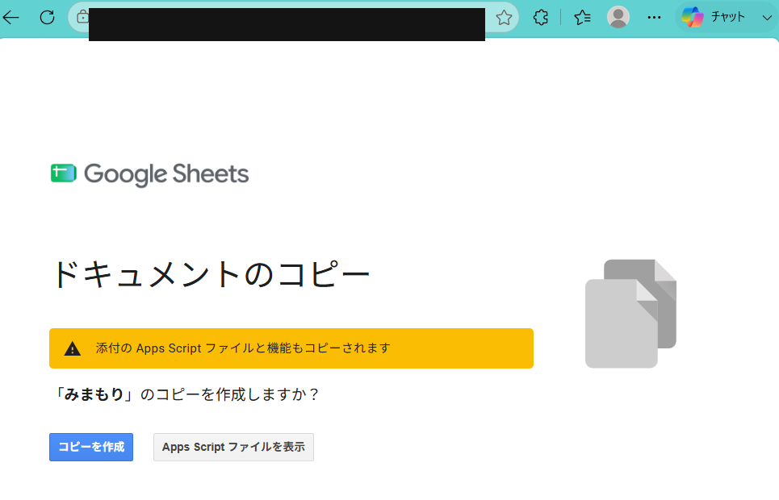
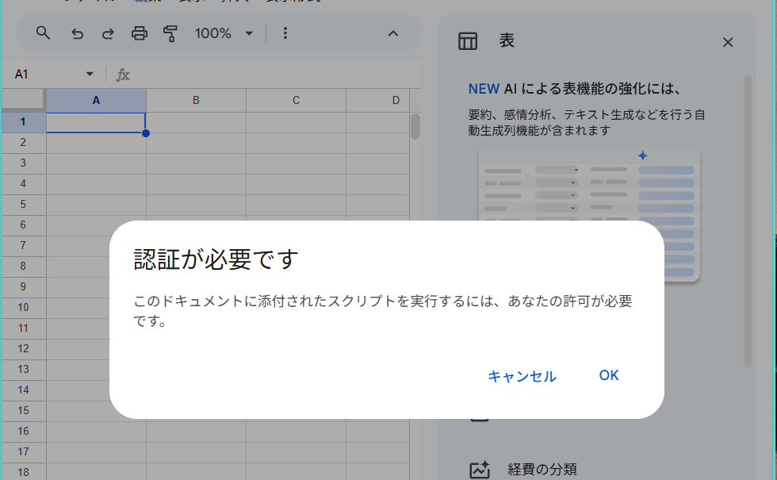
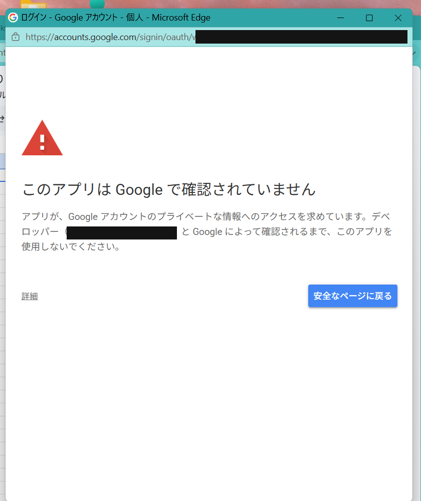
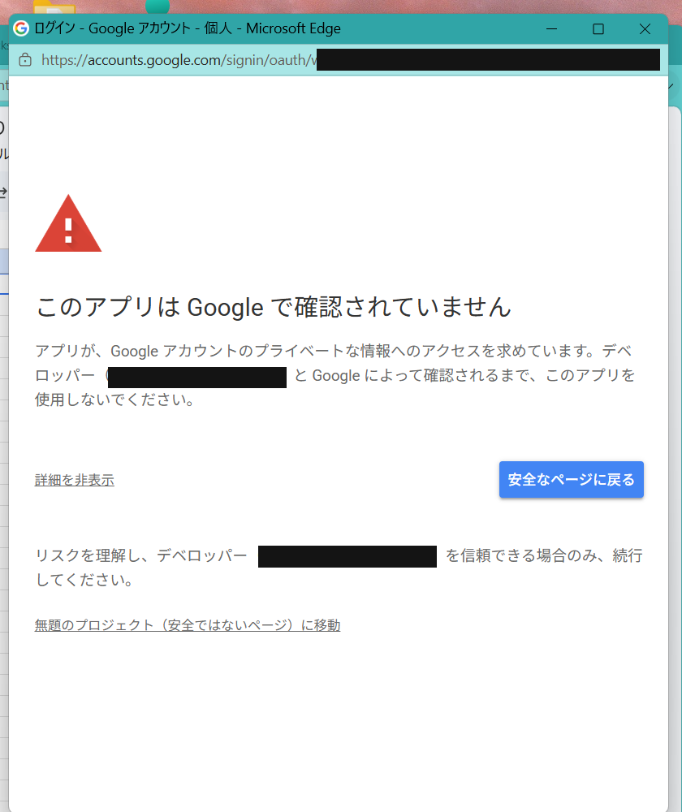
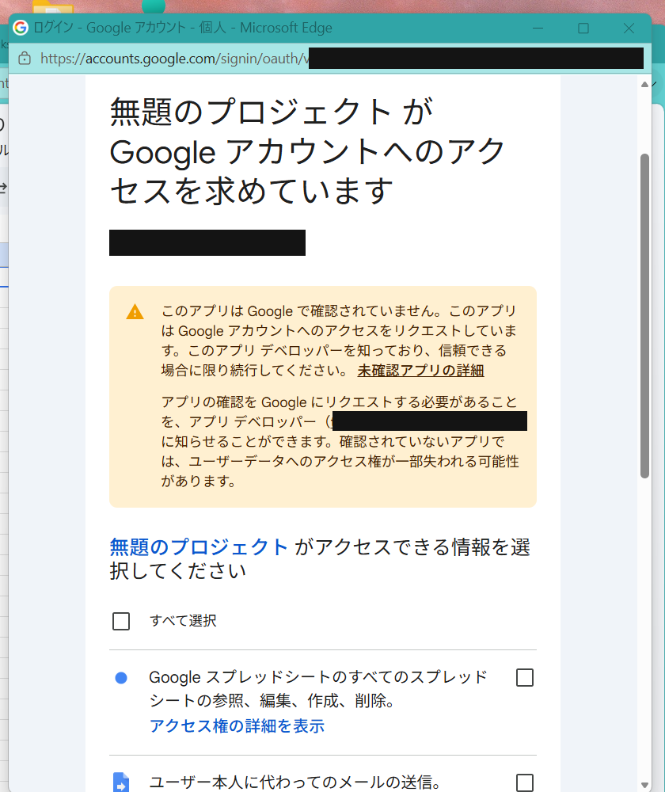
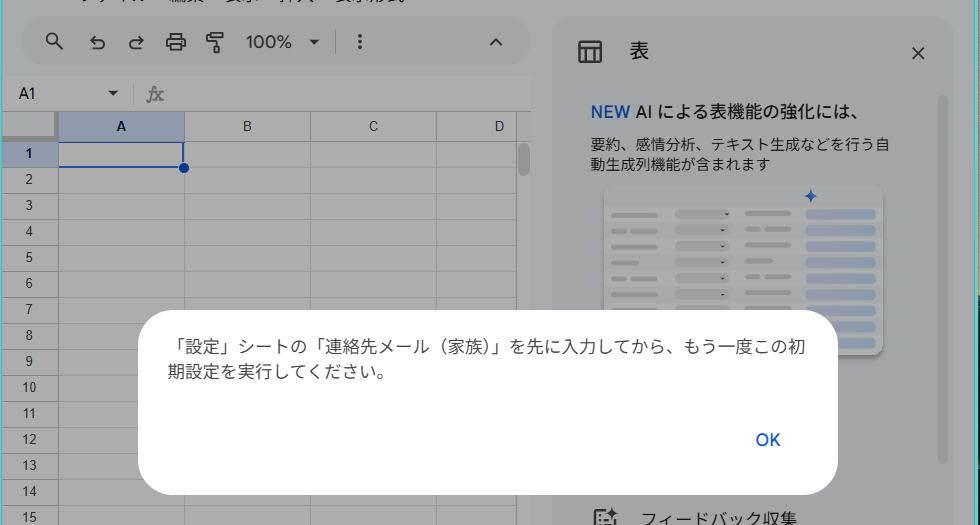

# みまもり　はじめかた

毎日ボタンを押すだけ。押されなかった日に、家族へ自動でメールが届く仕組みです。
**月額0円**。専用の機械もサーバーも要りません。

このページのとおりに進めれば動きます。**20〜30分**みておいてください。

---

## はじめる前に

**用意するもの**

| | |
|---|---|
| パソコン | 最初の設定だけ必要です（スマホだけではできません） |
| Googleアカウント | ふだんお使いのもので大丈夫です |
| スマホ | ボタンを押す人が使います。設定は最後だけ |

**登場人物は2人います**

- **押す人**（見守られる方）… スマホで1日1回ボタンを押すだけ
- **設定する人**（ご家族）… このページの作業をする人。通知メールもこの人に届きます

いま読んでいるのは「設定する人」向けです。

**最初に知っておいてほしいこと**

- 途中で「**このアプリはGoogleで確認されていません**」という赤い警告が出ます。**故障ではありません**。手順6でくわしく説明します
- 記録もメールも、**すべてあなた自身のGoogleアカウントの中**で動きます。作者や他人に、安否のデータや連絡先が渡ることはありません
- 途中で分からなくなったら、閉じてしまって大丈夫です。最初からやり直せます

---

## 手順1　ひな形をコピーする

配られたリンクを開きます。末尾が `/copy` になっているリンクです。



**「コピーを作成」**を押してください。

あなたのGoogleドライブに「**みまもりのコピー**」というスプレッドシートができます。
名前は「みまもり」など、好きなものに変えて構いません。

> **黄色い注意書きについて**
>
> 「添付の Apps Script ファイルと機能もコピーされます」と出ています。
> これは**そうでないと困る**ものです。見守りの中身（判定とメール送信のプログラム）が、
> スプレッドシートと一緒にあなたのドライブに複製される、という意味です。
>
> **押す前に中身を読みたい方へ**：右の「**Apps Script ファイルを表示**」を押すと、
> コピーする前にプログラムの全文を読めます。隠している部分はありません。

---

## 手順2　メニューが出るのを確認する

コピーしてできたスプレッドシートを開きます。

数秒待つと、上のメニューの右のほうに「**みまもり**」が増えます。

出ていなければ、**ページを再読み込み**してください（F5キー、または画面上部の丸い矢印）。

> 画面の幅が狭いと、メニューが「…」の中に隠れることがあります。
> **Windowsキー + ↑** で画面を最大化すると出てきます。

---

## 手順3　初期設定を押す（1回目）

メニューの「**みまもり**」→「**① 初期設定**」を押します。

すると承認画面が出ます。ここが**この作業でいちばんの山場**です。次の手順4へ。

---

## 手順4　⚠️ Googleの警告を通る（山場）

画面が5段階で進みます。あわてずに、1つずつ。**全部で1〜2分です。**

> 💡 この承認は**最初の1回だけ**です。2回目からは何も聞かれません。

---

### 4-1.　「認証が必要です」→「OK」



「このドキュメントに添付されたスクリプトを実行するには、あなたの許可が必要です。」と出ます。

**「OK」**を押してください。

---

### 4-2.　自分のGoogleアカウントを選ぶ

アカウントを選ぶ画面が出たら、**いつも使っているアカウント**を選びます。

> 別のブラウザ（Microsoft Edge など）の窓が開くことがありますが、そのまま進めて大丈夫です。

---

### 4-3.　「Google で確認されていません」→「詳細」



**ここで多くの人が止まります。でも、これは正常です。**

**なぜ出るのか**
Googleは、企業が作って審査を受けたアプリに「確認済み」の印をつけます。
これは個人が作ったプログラムで、審査を受けていません。だから
「素性が分からない」とGoogleが注意しているだけです。
**中身が悪いという意味ではありません。**

**それでも不安なときの確かめ方**
このプログラムの中身は、いま開いているスプレッドシートの
**「拡張機能 → Apps Script」でいつでも全部読めます。** 隠れている部分はありません。

大きな青いボタン（「安全なページに戻る」）ではなく、**左下の小さな「詳細」**を押してください。

---

### 4-4.　「（安全ではないページ）に移動」



「詳細」を押すと、下に一行増えます。

**「無題のプロジェクト（安全ではないページ）に移動」**を押してください。

> アプリ名が「**無題のプロジェクト**」と表示されますが、これで正常です。
> Apps Scriptの名前を変えてもここには反映されません。

---

### 4-5.　許可する内容を確認して、「すべて選択」



「アクセスできる情報を選択してください」という一覧が出ます。

**「すべて選択」にチェックを入れて、下の「続行」を押してください。**

⚠️ **一部だけ選ぶと動きません。** 3つとも、この仕組みを動かすのに必要です。

| 出てくる文言 | 何に使うのか |
|---|---|
| Googleスプレッドシートの参照、編集、作成、削除 | 設定と記録の読み書き |
| **ユーザー本人に代わってのメールの送信** | 家族への通知メール |
| （トリガー関連の項目） | 15分おきの見張りを動かす |

> **「すべてのスプレッドシート」と書いてあるのが気になる方へ**
>
> 正直に書きます。Googleの権限は「このシートだけ」と細かく指定することもできますが、
> **その指定をすると15分おきの見張りが動かなくなる**という、Google側の既知の不具合があります。
> 見守りで一番まずいのは見張りが止まることなので、あえて広いほうを選んでいます。
>
> なお、**メールについては「送信」だけ**です。受信箱を読む権限は求めていません。
> （プログラム内で `GmailApp` ではなく `MailApp` を使っているためです）

🚫 **もし次のようなものが並んでいたら、チェックせずに中止してください。**
- メールの**閲覧**・作成・**完全な削除**
- Googleドライブのすべてのファイル
- 連絡先／カレンダー

---

### 4-6.　この画面が出たら承認は成功です



> 「設定」シートの「連絡先メール（家族）」を先に入力してから、
> もう一度この初期設定を実行してください。

**これはエラーではありません。** 「まだ連絡先が空だから、見張りは始めていませんよ」
という案内です。「OK」を押して、次の手順5へ進んでください。

---

## 手順5　設定シートを埋める

承認が終わると「連絡先メールを先に入力してください」と出て、シートが何枚か作られます。

「**設定**」シートを開いて、B列を埋めてください。

| 項目 | 例 | 説明 |
|---|---|---|
| 見守る方のお名前 | 太郎 | 届くメールの文面に入ります |
| 連絡先メール（家族） | あなたのアドレス | **通知はここに届きます** |
| 締め切り時刻 | 10:00 | この時刻までに押されないと通知 |
| 毎日の報告メール | する | **「しない」にしないでください**（下の囲みを参照） |
| 熱中症の警戒を出す | する | 暑い日にボタン画面へ注意を出します |
| お住まいの都道府県 | 愛知県 | 暑さを調べるのに使います |

> **📮 毎日の報告メールを切らないでください**
>
> 見守りの仕組みで一番こわいのは、**黙って止まること**です。
> 止まったのに何も届かないと、「通知が来ない＝元気なんだな」と思い込んでしまいます。
>
> 毎日1通「きょうも元気です」が届いていれば、**メールが来ること自体が、
> この仕組みが生きている証明**になります。届かない日は「本人か、仕組みのどちらかに
> 何かあった」と分かる。うるさく感じても、切らない設計にしてあります。

**締め切り時刻の決め方**：ふだん起きる時刻より、**2時間ほど遅め**にしてください。
朝8時に起きる方なら10:00くらい。早すぎると押し忘れの誤報が増えます。

---

## 手順6　初期設定をもう1回押す

「**みまもり**」→「**① 初期設定**」をもう一度。今度は最後まで進みます。

- 15分おきの見張りが仕掛けられます
- 設定した連絡先に「**見守りを開始しました**」というメールが届きます

**このメールが届いたら、裏側は完成です。** 届かないときは、
「設定」シートのメールアドレスの打ち間違いを疑ってください。

---

## 手順7　ボタン画面を公開する（2つめの山場）

ボタンを押す画面から、いま作った仕組みを呼べるようにします。

**7-1.** 画面右上の「**デプロイ**」→「**新しいデプロイ**」

**7-2.** 左上の**歯車マーク**を押して、「**ウェブアプリ**」を選ぶ

> 📷 スクショを入れる場所：歯車 →「ウェブアプリ」を選ぶところ

**7-3.** 3か所を設定します

| 項目 | 選ぶもの |
|---|---|
| 説明 | `v1`（何でも構いません） |
| 次のユーザーとして実行 | **自分** |
| アクセスできるユーザー | **全員** |

> 「全員」にするのは、**押す人がログインなしでボタンを押せるようにする**ためです。
> URLは長く複雑で推測できませんが、**SNSなどに貼らないでください。**

**7-4.**「**デプロイ**」を押す

**7-5.** 出てきた「**ウェブアプリ**」のURLを**コピー**します

`https://script.google.com/macros/s/…/exec` という形で、**末尾が `/exec`** です。
（`/dev` で終わるほうをコピーすると動きません）

このURLは大事なので、メモ帳などに貼って保存しておいてください。

> 📷 スクショを入れる場所：デプロイ完了・URLが出ている画面

---

## 手順8　スマホにボタンを置く

ここからは、**ボタンを押す人のスマホ**での作業です。

**8-1.** スマホの **Chrome**（または Safari）で次を開きます

```
https://tomonori2.github.io/mimamori-app/
```

> ⚠️ **Googleアプリの中のブラウザではうまくいきません。**
> 必ず Chrome など、ふつうのブラウザで開いてください。
> （後の「ホーム画面に追加」が出てきません）

**8-2.** 画面いちばん下の小さな「**設定**」を押す

**8-3.** 手順7でコピーした**URLを貼り付けて保存**

**8-4.** 名前・締め切りなどが読み込まれることを確認する

**8-5.** 「**元気です**」を押してみる
→ ✓ が出れば成功です。赤い警告が出たらURLを見直してください

**8-6.** ブラウザのメニュー（⋮）→「**ホーム画面に追加**」

これでアプリのアイコンができます。次からはアイコンから開けます。

---

## 手順9　本当に見張っているか確かめる（15分テスト）

いちばん大事な確認です。**「押さなかったら本当に通知が来るか」**を試します。

1. パソコンのスプレッドシートに戻る
2. 「**みまもり**」→「**④ きょうの記録をリセット（テスト用）**」
3. 「**設定**」シートの締め切り時刻を、**いまの時刻より前**にする（例：いま14時なら `13:00`）
4. **15分以内**に「合図がありません」というメールが届けば合格
5. 確認できたら、スマホで「元気です」を押す
   →「◯時◯分に合図をされました」というメールが届きます
6. **締め切り時刻を本来の時刻に戻す**（戻し忘れに注意）

ここまで動けば、見守りの心臓部はすべて確認できています。

---

## 困ったときは

| 症状 | 見るところ |
|---|---|
| メニュー「みまもり」が出ない | ページを再読み込み。画面が狭いと「…」に隠れます |
| 開始メールが届かない | 「設定」シートのメールアドレスの打ち間違い。迷惑メールも確認 |
| ボタンを押すと赤い警告 | URLの末尾が `/exec` か。`/dev` は動きません |
| 「ホーム画面に追加」が出ない | Googleアプリ内蔵のブラウザです。Chromeで開き直す |
| 通知がすぐ来ない | 見張りは15分おきです。最大15分遅れます |
| 通知が何度も届く | 締め切り時刻を戻し忘れていませんか |

---

## 使いはじめてからの注意

**押す端末は1台だけにしてください。**
押せる端末が増えると、ご本人が押していない日でも別の端末から「元気」と記録されて、
アラートが止まってしまいます。テストで使った端末は、ボタン画面の設定にある
「**この端末の設定を消す**」で解除できます。

**最初の1週間は、毎日メールが届いているか見てください。**
届かない日があれば、それは「本人か、仕組みのどちらかに何かあった」というサインです。

---

## この仕組みについて

- 記録は**あなたのスプレッドシート**に入り、メールは**あなたのGmail**から出ます
- 作者は、安否のデータもメールアドレスも一切持ちません
- 止めるのも消すのも、あなたの自由です（トリガーを消せば止まります）
- **人の安否に関わる道具**です。ご自身で一度動かして確かめてからお使いください
